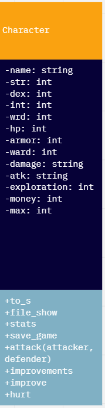
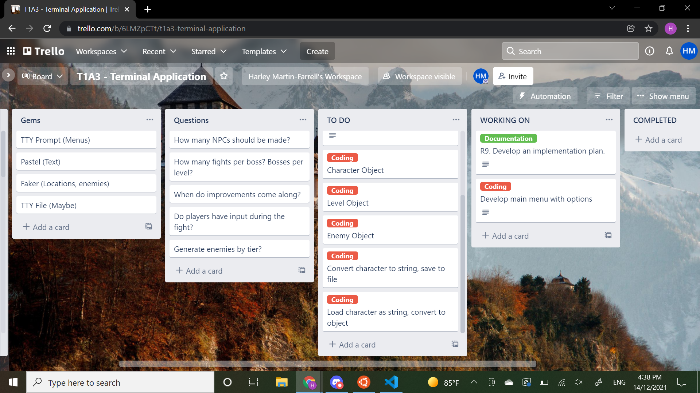
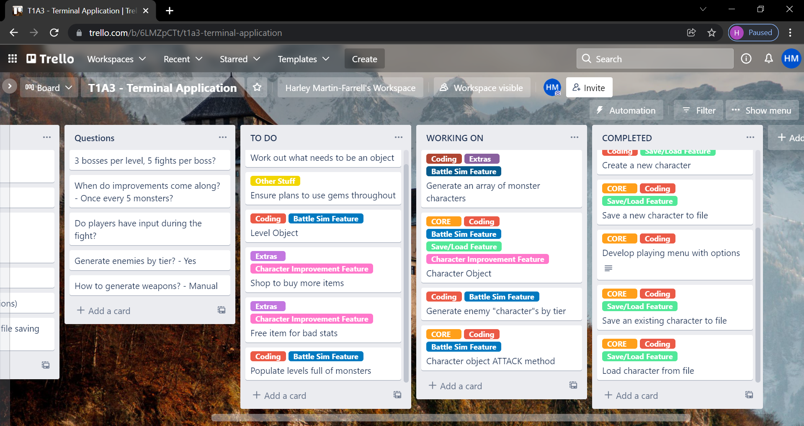
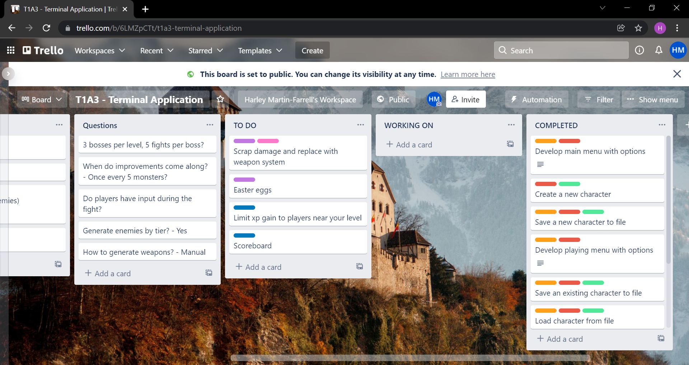

# Arkane Orkz README

Arkane Orkz is a text-based quasi-multiplayer autobattler made in Ruby and based off of Miscast's "Arcane Ugly" RPG System.
The purpose of the game is to make an "Ork" and battle other users to improve and eventually take the title of "DA MEANEST"!

Arkane Orkz is available on github here: [link](https://github.com/harley-ca/harley-ca_T1A3_second) 

---

## Arcane Ugly

This game, Arkane Orkz, is designed mechanically using Arcane Ugly.

"[Arcane Ugly](https://miscastterrain.itch.io/arcaneugly) is a whimdark TTRPG set in place of strange, wild and whimsical magic, curious creatures and fantastic treasures.

Created by Miscast and friends, the game and rules are designed to be fast, easy to learn and hackable."

Arcane Ugly is currently in early release and is available for purchase on their site. Also available is a free downloadable System Reference Document. A majority of the mechanics in Arkane Orkz are derived from this document.

The Arcane Ugly rulebook is available here: [link](https://miscastterrain.itch.io/arcaneugly)

The Miscast Youtube Channel can be found here: [link](https://www.youtube.com/channel/UCUtsRCYEE-hCPsftezm9wzA)

---

## User Guide

### Installation

1. Clone from repo to local OR download zip file and unzip
2. Ensure you have a Unix Shell and Ruby installed. (Git Bash is free and easy)
3. Run ArkaneOrkz.sh

## Scope

Arkane Orks is intended to be a small local machine or network multiplayer game, to be player for entertainment.

The game will allow players to make characters and battle against other players to level up and improve their character. The purpose of this ultimately is to provide enternment and possibly a fun talking point for users playing together locally.

Have you ever been standing at the water cooler with your co-worker, fiddling with your paisley blue tie and looking around the room awkwardly because you didn't catch the game last night and have nothing to talk about? No more, says Arkane Orkz. From now on, just cd your way into the shared network and check out the high scores and you'll be up to date with all of the office gossip. 

I'm developing Arkane Orkz as a way to get incorporate my passion for TTRPGs into my assessment, as well as hopefully creating a framework that I could use in the future for a proper tool to use with Arcane Ugly.

The target audience of Arkane Orkz is described best as a niche of people who are willing to eschew triple-A games to play local system multiplayer text based games, my poor educators and my unwitting peers.

The intended use for most users will be launch the game via the included bash script, which should automatically install the needed dependencies and launch the game to the main menu. From their, they will be able to navigate menus using the Up and Down keys, as well as provide input via the keyboard for certain things. 

---

## Features

1. Character Creation
    - Accepts typed user input for a name, and utilises TTY-Prompt for selection from a list, storing all inputs in variables for use later.
    - Generates random statistics using rand() and allows user to reroll if they choose.
    - Until Loop used as error handling against blank, very long names or nil.
    - Automatic generation is possible through command line, as well as the ability to provide a name or have a random one generated by Faker.
    - Creates new "Character" Objects, which can be used throughout the rest of the game.
2. Save / Load
    - Saves the currently loaded player to "saves.yml"
        - If there is a previous save, asks before overwriting and gives option to exit saving or change current name.
    - Uses YAML encoding to store multiple Objects in one file.
    - Loading accepts input from the command line and can accept a name to quickly load a character on startup.
    - Loading shows a table generated with Terminal-Table with all current saves, including names, level and experience.
    - Accepts typed user input for name of intended character.
    - Built in error handling for blank or wrong inputs.
3. Battle
    - Shows the Terminal-Table of all current saves and accepts typed user input for adversary.
    - Built in error handling for wrong names.
    - Pits the currently loaded save against the chosen save in a turn based fight.
    - Background initiative roll allows for random chance of User going first in the fight.
    - Utilises a real TTRPG system converted into Ruby for attack and damage rolls.
    - Uses Colorize to print flavorful messages to the terminal explaining each attack and outcome.
    - When a user wins, their character is award money and experience.
    - If a character reaches an experience value that is a multiple of 5, they gain a level.
    - Level up includes the ability to choose from a list of improvements to your character and a boost to maximum hitpoints.

---

## Control Flow

---

## Intended User Interaction

Arkane Orkz is designed to have a main menu that the player is brought back to repeatedly, with feedback messages displayed above the menu. These feedback messages are tailored to the error and will often be enough to explain to a user if something they are doing is not working. 

The main menu options are as follows:

1. Battle
	- Clears menu, shows table of info and prompts user for input.
	- Errors will return user to main menu with feedback referencing the particular error, including:
		- No character loaded
		- Character doesn't exist for the name user typed
	- User tries to fight their own character
	- If no errors, the battle occurs and is typed to screen.
	- Message at the end of the fight informs user of win/loss and sleeps for 5 seconds.
	- Then returns to main menu, with a colour coded feedback message explaining win/loss.
2. New Character
	- Prompts user for name, built in error handling for blank names.
	- User is shown statistics and is prompted with a menu to choose whether to keep them.
	- User is then presented with a menu of weapons to choose from.
	- User is returned to the main menu with a feedback message saying character created.
3. Save
	- If there is no previous character of the current characters name, saves to file and returns to main menu.
	- Otherwise prompts the user to choose whether to overwrite the old save. Yes overwrites that save and returns to main menu.
	- No to overwriting prompts the user to rename their current character, which then saves under that name and returns to main menu.
4. Load
	- User is shown a table listing all saved characters.
	- User is prompted to input a character name.
	- Error handling shows feedback messages for blank input and characters that don't exist.
	- If the name provided matches a character, that character is loaded.
5. Exit
	- Displays exit message and then exits program.

---

## Implementation Plan
### Aka, Trello

You can find my Implementation Plan on Trello here: [link](https://trello.com/b/6LMZpCTt/t1a3-terminal-application)

Some pictures of it during the project:

